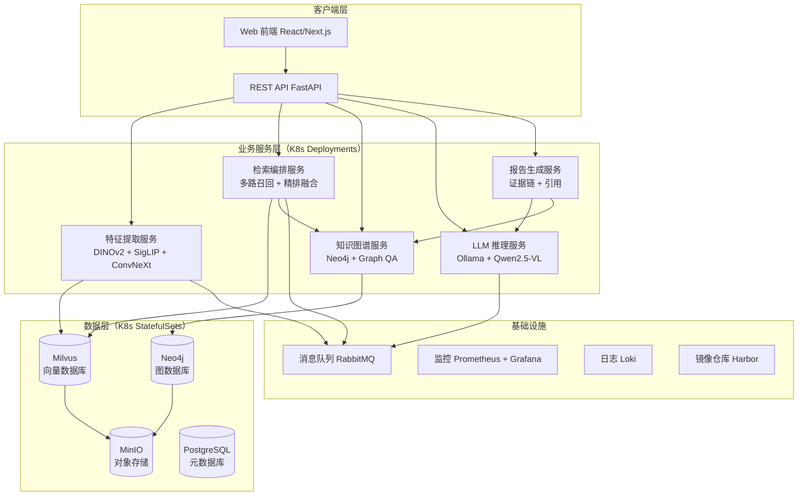
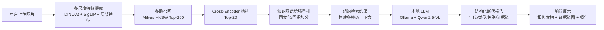

# 考古文物断代与鉴定系统

> 基于 **视觉检索 + 知识图谱 + 多模态大模型** 的考古文物断代与鉴定系统 。
> 上传文物图片 → 多尺度特征提取 → 多路召回精排 → 图谱增强 → 本地 LLM 生成带证据链的断代报告。

---

## 核心特性

- **高精度检索**：多尺度特征（DINOv2 + SigLIP + 局部特征）+ 可学习融合 + 对比学习微调 + Cross-Encoder 精排，目标 culture P@5 ≥ 0.70
- **快速响应**：多路召回（<50ms）+ 精排（<200ms）+ 图谱重排（<100ms），端到端查询目标 < 5s
- **多源数据**：MET / Harvard / Cleveland / Smithsonian / Rijksmuseum / Europeana 等多博物馆汇聚，目标 5 万+ 件
- **深度知识图谱**：Neo4j 存储文化/时期/材质/器型/纹饰/技术多维关系，支持证据链推理
- **完全本地化**：LLM 使用本地 Ollama（Qwen2.5-VL 量化版），数据不出域、可离线运行
- **Kubernetes 原生部署**：K3s 轻量集群 + Helm Chart，服务独立扩缩容、自愈、滚动更新
- **全栈可观测**：Prometheus + Grafana + Loki，服务健康、延迟、精度指标实时监控

---

## 系统架构

### 处理流程

---

## 技术栈

| 模块 | 技术 |
|------|------|
| 语言 | Python 3.10+（服务）/ TypeScript（前端） |
| 深度学习 | PyTorch 2.x · Transformers |
| 视觉特征 | DINOv2-base（全局）+ DINOv2-registers（局部）+ SigLIP（语义） |
| 特征融合 | 可学习注意力门控（Attention Gating） |
| 对比学习 | SimCLR + Center Loss（文物同类聚集） |
| 多模态 LLM | Qwen2.5-VL 量化版（Ollama 本地推理） |
| 向量检索 | Milvus（K8s Operator 部署，HNSW 索引） |
| 知识图谱 | Neo4j 5.x（StatefulSet，多节点集群） |
| 元数据存储 | PostgreSQL |
| 对象存储 | MinIO（图片/模型/特征文件） |
| 消息队列 | RabbitMQ（异步任务解耦） |
| 后端服务 | FastAPI + gRPC |
| 前端 | Next.js (React) + D3.js 证据链可视化 |
| 编排调度 | K3s + Helm + GitHub Actions CI/CD |
| 监控 | Prometheus + Grafana + Loki |
| 依赖管理 | Poetry（Python lockfile 可复现构建） |
| 数据源 | MET / Harvard / Cleveland / Smithsonian / Rijksmuseum / Europeana / Wikidata |

---

## 分阶段路线图

| 阶段 | 内容 | 预计周期 | 状态 |
|------|------|---------|------|
| 阶段 0 | 基础设施（K3s / Harbor / CI/CD / 监控） | 第 1-2 月 | ⬜ |
| 阶段 1 | 数据引擎（多源采集 / 清洗 / 标注 / 存储） | 第 3-5 月 | ⬜ |
| 阶段 2 | 特征工程（多尺度提取 / 融合 / 对比学习 / Milvus） | 第 6-8 月 | ⬜ |
| 阶段 3 | 检索引擎（多路召回 / 精排 / 图谱重排） | 第 9-11 月 | ⬜ |
| 阶段 4 | 知识图谱（Wikidata 导入 / Neo4j 集群 / 查询库） | 第 12-14 月 | ⬜ |
| 阶段 5 | LLM 集成（本地推理 / Prompt / 微调 / 评估） | 第 15-17 月 | ⬜ |
| 阶段 6 | 前端与应用（Next.js / 可视化 / 报告渲染） | 第 18-20 月 | ⬜ |
| 阶段 7 | 评估与优化（延迟 / 精度 / 专家测试 / 发布） | 第 21-24 月 | ⬜ |

> 详细任务清单与进度日志见 [PROGRESS.md](PROGRESS.md)。

---

## 许可与数据合规

- 开放数据来源：MET Open Access (CC0)、Harvard Art Museums (CC0)、Cleveland Museum of Art (CC0)、Smithsonian (CC0)、Rijksmuseum (Public Domain)、Europeana、Wikidata (CC0)
- 模型权重：DINOv2 (Apache 2.0)、SigLIP (Apache 2.0)、Qwen2.5-VL (Apache 2.0)
- 本项目代码：Apache 2.0
